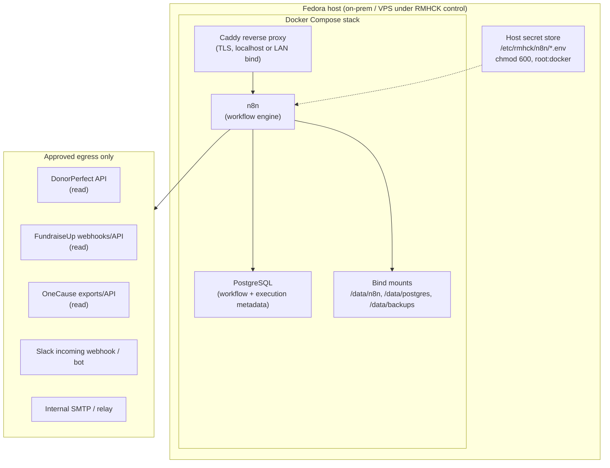

# RMH-144 Plan: Self-Hosted n8n Automation Backbone (Fedora)

## Status

- **Draft infrastructure plan only** — no production deployment, credentials, or live workflow execution.
- **First workflow candidate selected:** large-gift alerts (read-only detection + Slack/email notification).
- **Stop point reached** before credential storage, production execution, or permission changes.

## Purpose

Plan a self-hosted n8n instance on a Fedora host to support event-driven RMHCK workflows while keeping donor data on-machine except through explicitly approved outbound integrations (Slack, email, vendor APIs).

This document satisfies RMH-144 acceptance criteria:

1. Documented deployment plan and threat/ops notes.
2. First workflow candidate selected with rationale.
3. Human approval points explicit before credentials or production execution.

## Constraints (from issue)

| Constraint | Plan response |
|------------|---------------|
| Data must not leave the machine except through approved integrations | Host-bound Docker volumes; egress allowlist; workflows documented as read-only vs write-capable |
| Permission/security changes require human approval | Approval gates in §Human approval points; no auto-provisioning of IAM, firewall, or CRM permissions |
| Infrastructure planning before implementation | Reference Compose and ops runbooks only; production cutover is a separate issue |

## Target architecture



### Design principles

1. **Single automation host** — one Fedora box runs the full stack; no multi-tenant or shared SaaS for workflow state.
2. **PostgreSQL for durability** — n8n execution history, credentials (encrypted by n8n), and workflow definitions live in Postgres on local disk.
3. **No inbound public exposure by default** — UI and webhooks reachable only via VPN, SSH tunnel, or reverse proxy on a restricted interface.
4. **Read-first workflows** — initial workflows query or receive events; CRM writes are out of scope for v1.
5. **Human-in-the-loop for judgment** — dedupe merges, gift adjustments, and bulk operations stay manual.

## Fedora host prerequisites

### OS and packages

| Item | Recommendation |
|------|----------------|
| OS | Fedora 40+ (or current stable at deploy time) |
| Container runtime | Docker Engine + Docker Compose plugin (`docker compose`) |
| Firewall | `firewalld`; default deny inbound except SSH (and proxy port if required) |
| Time sync | `chronyd` enabled (webhook signature validation, cron triggers) |
| Updates | `dnf-automatic` for security patches; n8n image pin + monthly review |

### Suggested directory layout

```
/opt/rmhck/n8n/              # Compose project root (reference: docs/n8n/)
/etc/rmhck/n8n/              # Secret env files (not in git)
/data/n8n/                     # n8n user data (encryption key, binary assets)
/data/postgres/                # PostgreSQL data directory
/data/backups/n8n/             # Restic or pg_dump targets
/var/log/rmhck/n8n/            # Optional forwarded container logs
```

### Service account

- Run Compose under a dedicated Linux user `rmhck-n8n` (not root).
- User is in `docker` group only; secret files owned `root:rmhck-n8n` with mode `640` or tighter.

## Docker Compose plan

Reference file: [`docs/n8n/docker-compose.reference.yml`](docs/n8n/docker-compose.reference.yml)

### Services

| Service | Role | Notes |
|---------|------|-------|
| `postgres` | Workflow DB | Postgres 16; healthcheck; no host port publish |
| `n8n` | Workflow engine | Pin image tag (e.g. `n8nio/n8n:1.x.y`); depends on healthy Postgres |
| `caddy` (optional) | TLS termination | Binds `127.0.0.1:443` or LAN-only; basic auth in front of n8n UI |

### Network isolation

- Single user-defined bridge network `rmhck-n8n-internal`.
- **Do not** publish Postgres to the host.
- Publish n8n only through Caddy on a restricted bind address, or use SSH port-forward for admin access.

### Environment (non-secret)

Set via Compose `environment` or `.env` (non-sensitive values only):

| Variable | Purpose |
|----------|---------|
| `N8N_HOST` | Public hostname used in webhook URLs (if any) |
| `N8N_PROTOCOL` | `https` behind proxy |
| `N8N_ENCRYPTION_KEY` | **Secret** — 32+ char key; store in `/etc/rmhck/n8n/n8n.env` |
| `DB_TYPE=postgresdb` | Use Postgres backend |
| `EXECUTIONS_DATA_SAVE_ON_SUCCESS` | `all` initially for debugging; tighten to `none` after stabilization |
| `GENERIC_TIMEZONE` | Org timezone (e.g. `America/Chicago`) |
| `N8N_BLOCK_ENV_ACCESS_IN_NODE` | `true` — reduce credential leakage via expressions |

### Resource limits (Compose `deploy.resources`)

- n8n: 1–2 CPU, 2 GiB RAM (adjust after profiling).
- Postgres: 0.5–1 CPU, 1 GiB RAM.

## Local data, storage, and backup

### What is stored locally

| Data | Location | Sensitivity |
|------|----------|-------------|
| Workflow JSON | Postgres | Medium — may embed field names, logic |
| Execution logs | Postgres | **High** — may contain donor PII in node I/O |
| n8n credentials vault | Postgres (encrypted with `N8N_ENCRYPTION_KEY`) | **Critical** |
| Webhook payloads (transient) | Memory / execution log | **High** |
| Export files (if used) | `/data/n8n/` | **High** |

### Retention

| Artifact | Initial policy | Review trigger |
|----------|----------------|----------------|
| Successful execution logs | 30 days | After first month of ops |
| Failed execution logs | 90 days | Incident investigation |
| Postgres backups | 30 daily + 12 weekly | Compliance review |
| Workflow exports (git) | Versioned in private repo | On each workflow change |

### Backup procedure (planned)

1. **Nightly `pg_dump`** from a sidecar or host cron into `/data/backups/n8n/postgres/`.
2. **Copy `/data/n8n/`** (encryption key backup is critical — store separately in password manager).
3. **Restic** (or similar) to encrypted off-host backup target only if RMHCK approves off-machine backup storage; otherwise backups remain on the same host on a separate disk.
4. **Quarterly restore drill** — restore to a staging Compose stack and verify workflow import.

### Disaster recovery

- RPO: 24 hours (nightly dump).
- RTO: 4 hours (manual restore on replacement Fedora host).
- Document restore steps in a follow-up ops runbook issue.

## Secret handling

**No production credentials are created or stored as part of this plan.**

### Secret inventory (future)

| Integration | Secret type | Storage | Used by workflow |
|-------------|-------------|---------|------------------|
| DonorPerfect | API user/key | n8n credential + optional host env | Large-gift poll, duplicate export |
| FundraiseUp | Webhook signing secret, API key | n8n credential | Real-time gift events |
| OneCause | API key / export token | n8n credential | Event registration glue |
| Slack | Bot token or incoming webhook URL | n8n credential | Alerts |
| Email | SMTP user/password or relay allowlist | n8n credential | Alert fallback |

### Handling rules

1. **Host files** — `/etc/rmhck/n8n/*.env`, mode `600`, never committed to git.
2. **n8n credentials** — created in UI or import after approval; scoped per workflow minimum privilege.
3. **Rotation** — quarterly or on staff turnover; document owners in Linear.
4. **Encryption key** — `N8N_ENCRYPTION_KEY` generated once (`openssl rand -hex 32`); backup in org password manager; loss = credential vault unrecoverable.
5. **No secrets in workflow JSON exports** — use credential references only; scan exports before commit.
6. **Block env access in nodes** — `N8N_BLOCK_ENV_ACCESS_IN_NODE=true` to limit expression-based leakage.

### Approved data egress paths

Only these outbound channels are in scope for v1:

- DonorPerfect HTTPS API (read queries)
- FundraiseUp HTTPS webhooks/API (read)
- OneCause HTTPS API (read)
- Slack HTTPS API
- SMTP to approved relay

Any new integration requires a human approval entry in the workflow catalog.

## Candidate workflows

### 1. Large-gift alerts — **selected as first workflow**

| Aspect | Detail |
|--------|--------|
| Trigger | Scheduled poll (DonorPerfect) every 15–60 min **or** FundraiseUp webhook for real-time |
| Logic | Gift amount ≥ configurable threshold (e.g. $1,000); exclude recurring micro-gifts if needed |
| Output | Slack message to `#development` (or dedicated channel) with donor name, amount, campaign, link to CRM |
| CRM writes | **None** |
| Human review | Optional acknowledgment in Slack; no auto-assignment |
| Risk | Low — read + notification |

**Why first:** Bounded scope, immediate ops value, no CRM mutation, easy to dry-run against a single test gift, validates secret handling and alerting path end-to-end.

### 2. Weekly duplicate detection — human-reviewed

| Aspect | Detail |
|--------|--------|
| Trigger | Weekly cron (Sunday night) |
| Logic | Query DonorPerfect for duplicate candidates (name + email + address fuzzy match); optional cross-check with FundraiseUp emails |
| Output | CSV or Google Sheet **on local disk** + Slack summary with row count |
| CRM writes | **None automated** |
| Human review | **Required** — staff reviews sheet and performs merges in DonorPerfect manually |
| Risk | Medium — bulk PII in execution logs and export files |

### 3. Cross-system glue — case-by-case

| Aspect | Detail |
|--------|--------|
| Examples | OneCause registration → Slack reminder; FundraiseUp failure → email ops |
| CRM writes | **Disabled in v1** |
| Human review | Required before any write-back or field update workflows |
| Risk | Medium to high depending on scope |

### Workflow approval matrix

| Workflow | Auto-run in production | Human review before CRM impact |
|----------|------------------------|----------------------------------|
| Large-gift alerts | Yes (after approval gate §A4) | N/A (no CRM writes) |
| Weekly duplicate detection | Yes (after approval gate §A4) | **Yes — merges manual** |
| Cross-system glue (read-only) | Per workflow sign-off | Yes for any write path |
| Cross-system glue (writes) | **Not in v1** | **Yes — explicit per workflow** |

## Threat model and ops notes

### Threats and mitigations

| Threat | Impact | Mitigation |
|--------|--------|------------|
| n8n UI exposed to internet | Credential theft, data exfiltration | VPN/SSH only; Caddy basic auth; fail2ban on SSH |
| Stolen `N8N_ENCRYPTION_KEY` | Decrypt stored credentials | Key in password manager; file permissions; separate backup |
| Over-broad DonorPerfect API key | Mass export | Read-only DP user; query limits; audit DP login |
| Webhook spoofing (FundraiseUp) | False alerts | Verify signing secret; IP allowlist if vendor supports |
| Execution log PII retention | Compliance exposure | Retention policy; success log pruning |
| Container escape | Host compromise | Keep Docker updated; non-root where possible; minimal host packages |
| Supply chain (n8n image) | Backdoor | Pin digests; monthly image review |
| Insider workflow edit | Exfiltration via HTTP node | Restrict n8n admin to 1–2 users; workflow change review in git |

### Operational runbook (planned)

| Task | Frequency | Owner |
|------|-----------|-------|
| Check failed executions | Daily | Database Coordinator |
| Review disk usage `/data` | Weekly | Database Coordinator |
| Apply Fedora security updates | Weekly | With human approval for reboots |
| Bump n8n image | Monthly | After reading release notes |
| Backup verify | Quarterly | Database Coordinator |
| Access review (n8n users) | Quarterly | Manager |

### Monitoring (minimal v1)

- Docker healthchecks + optional uptime probe on n8n `/healthz`.
- Slack alert on container restart loop (systemd unit or external monitor).
- No donor data sent to third-party monitoring SaaS.

### Logging

- Container logs via `docker compose logs`; rotate with journald or logrotate.
- Treat logs as **sensitive** — may contain webhook payloads.

## Human approval points

Work **must not** proceed past these gates without explicit human sign-off in Linear (issue comment or approval label removed).

| ID | Gate | Approver | Before |
|----|------|----------|--------|
| **A1** | Plan adoption | Human assignee (RMH-144) | Any host provisioning |
| **A2** | Host security baseline | Human assignee + IT | Opening firewall ports, SSH hardening, sudo |
| **A3** | Credential creation | Human assignee | Creating DonorPerfect, FundraiseUp, OneCause, Slack, SMTP credentials in n8n |
| **A4** | Production workflow activation | Human assignee | Enabling cron/webhook triggers against production systems |
| **A5** | Execution log retention policy | Human assignee | Storing PII in logs beyond dry-run |
| **A6** | Off-host backup | Human assignee | Restic/S3 or any backup leaving the machine |
| **A7** | CRM write workflows | Manager / data owner | Any node that creates/updates DonorPerfect records |
| **A8** | New integration egress | Human assignee | HTTP Request to a host not listed in §Approved data egress |

### Recommended implementation sequence (post-approval)

1. **A1** — Approve this plan.
2. Provision Fedora VM / bare metal; install Docker; create directory layout.
3. **A2** — Harden SSH, firewalld, automatic updates.
4. Deploy Compose stack with **no** integration credentials; verify UI login.
5. **A3** — Create read-only DonorPerfect API credential; FundraiseUp webhook in test mode.
6. Build large-gift workflow in **manual execution** mode; dry-run with test data.
7. **A4** — Enable schedule/webhook in production.
8. Document workflow JSON in private git; add duplicate-detection workflow as phase 2.

## First workflow specification (large-gift alerts)

### Draft workflow outline

```
Trigger: Cron */30 * * * * (or FundraiseUp webhook)
  → DonorPerfect: query gifts since last run where amount >= threshold
  → Filter: dedupe by gift_id in workflow static data
  → Slack: post formatted alert
  → (Optional) Email: same content to ops alias
```

### Configuration parameters (human-set at deploy)

| Parameter | Example | Notes |
|-----------|---------|-------|
| `GIFT_THRESHOLD_USD` | `1000` | Business rule |
| `SLACK_CHANNEL` | `#major-gifts` | Created before A4 |
| `POLL_LOOKBACK_MINUTES` | `45` | Overlap to avoid misses |

### Dry-run checklist (before A4)

- [ ] Manual execution returns zero rows without error
- [ ] Manual execution with test gift posts to **private** Slack channel
- [ ] No donor fields beyond approved set in message
- [ ] Execution log reviewed for PII leakage
- [ ] Failed-run alert path tested

## Suggested Linear issue updates

### Progress comment (copy/paste)

```md
RMH-144 planning draft complete in repo:

- `RMH-144_n8n_fedora_plan.md` — deployment plan, backup/secret handling, threat/ops notes, approval gates
- `docs/n8n/docker-compose.reference.yml` — reference Compose (not deployed)

**First workflow candidate:** large-gift alerts (read-only DonorPerfect/FundraiseUp → Slack/email).

No credentials stored, no production deployment, no workflow execution.

Stopping at approval gate A1 for human review before implementation issue.
```

### Definition of done (this issue)

- [x] Documented deployment plan and threat/ops notes
- [x] First workflow candidate selected (large-gift alerts)
- [x] Human approval points explicit before credentials or production execution
- [ ] Human sign-off on plan (A1) — **pending**

## Explicit stop point

This issue is **planning only**. Do not provision hosts, store credentials, or enable production workflows until approval gates A1–A4 are satisfied in a follow-up implementation issue.
